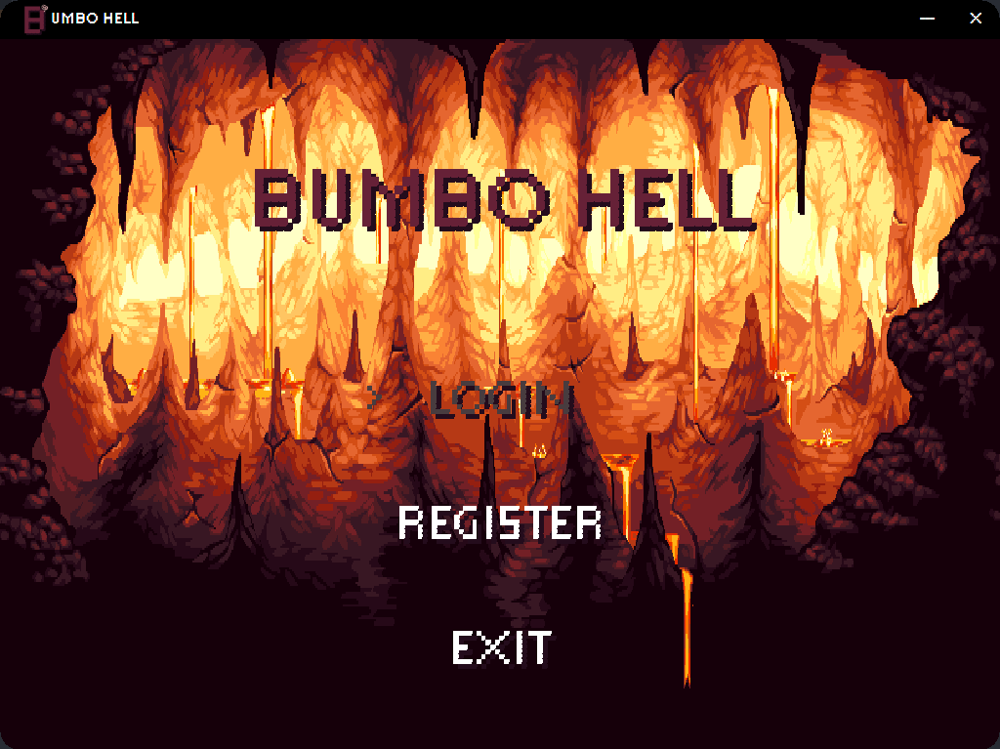
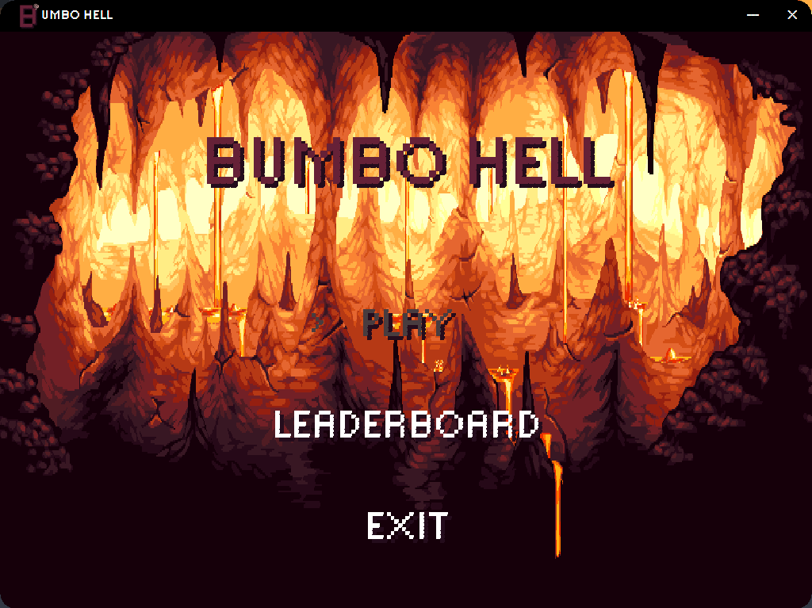
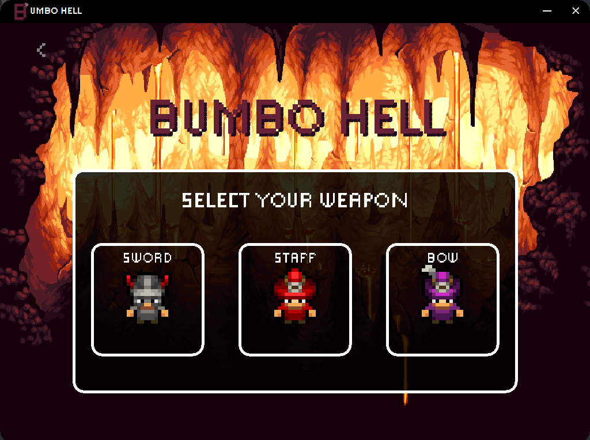
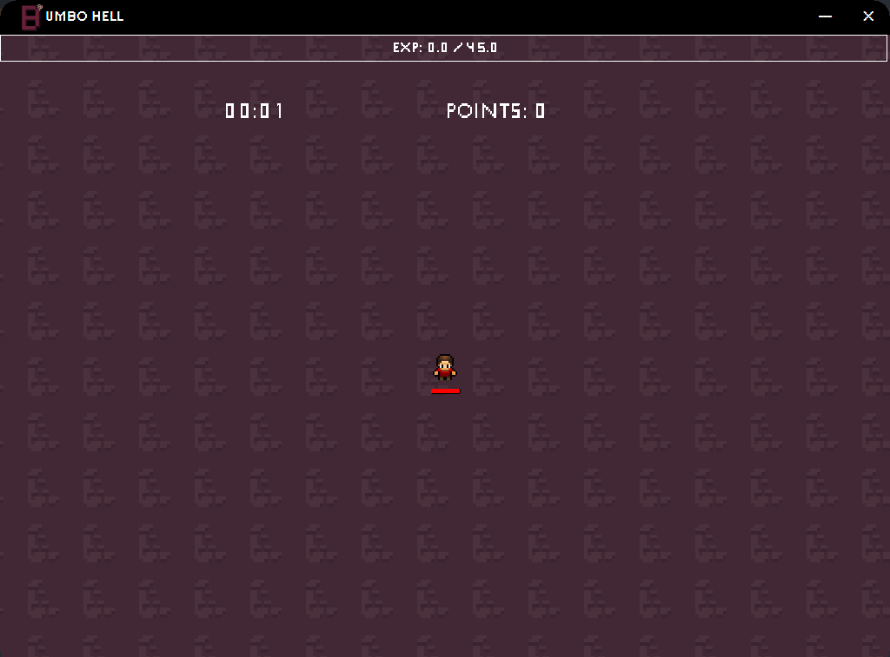

# Bumbo Hell

2D pixel roguelike reverse-bullet hell game where the player tries to fend off opponents for as long as possible, while
earning points. 

Bumbo Hell is primarily built on Java, utilizing both Java AWT Graphics and Java Swing for the game's front-end.
In addition to its frontend, Bumbo Hell makes use of PostgreSQL as its database to store and manage data with an integration to Supabase through Java Database Connectivity (JDBC).
## Project Status

Bumbo Hell is <b>currently under development.</b>

### Features in Development
- Weapon Buff Selection Screen
- Leaderboard Screen
- Game Result Screen
- Settings Screen
- Player Death Animation
- Bosses

### Additional
- Map Rework
- Additional Mobs
- Controller Support

## Visuals
### Title Screen

### Menu Screen

### Weapon Screen

### Game Screen

## Acknowledgment
RyiSnow  
&nbsp; [Ko-fi](https://ko-fi.com/ryisnow) 
&nbsp; [Youtube](https://www.youtube.com/@RyiSnow)

## License
[MIT](https://choosealicense.com/licenses/mit/)
